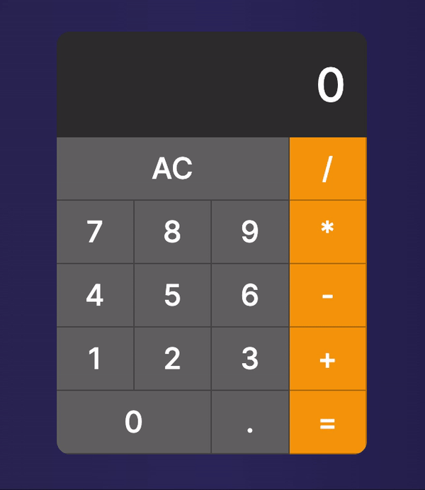

<h1 align="center">Calculadora 📟
</h1>

<div align="center">
    
</div>

## 📚 Sobre
Construção de uma calculadora para a prática de componentizações em **ReactJs**.

## 🚀 Tecnologias Utilizadas
- ReactJs
- Javascript
- Css
## ⏱️ Iniciar projeto

```bash
# Clone o repositório:
https://github.com/polyanetuag/calculadora

# Instale as dependências
$ yarn install

# Execute o servidor de desenvolvimento:
$ yarn start

```

## 📋 Licença
Esse projeto está sob a licença MIT. 

---

Desenvolvido com 💜 por Polyane Tuag
